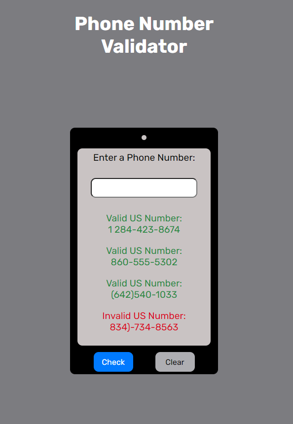

# About

With this application, you can enter a phone number in various formats, and the program will determine whether or not it is a valid U.S. phone number. It does this by testing the input against an array of
regular expressions to determine the validity of the input. The functionalities of this program include:
  - Checking the number
  * Clearing the input and output values

# Getting Started

1. Download the files and store in a directory on your computer.
2. Copy the path to the index.html file in the directory.
3. Open your browser of choice.
4. Paste the path into your address bar.
5. Begin entering a number you would like to check.

# To-Do

- [ ] Add an option for numbers outside of the U.S. and add functionality for checking them
- [ ] Redesign output to display a feedback similar to a text bubble like that on iOS devices
